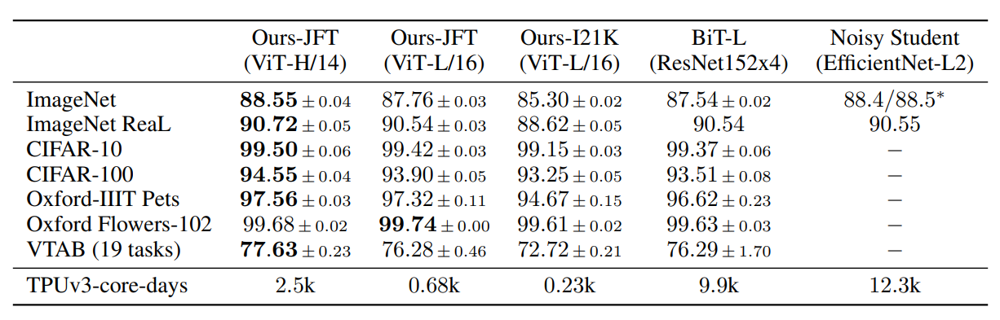

# Vision Transformer
Pytorch reimplementation of [Google's repository for the ViT model](https://github.com/google-research/vision_transformer) that was released with the paper [An Image is Worth 16x16 Words: Transformers for Image Recognition at Scale](https://arxiv.org/abs/2010.11929) by Alexey Dosovitskiy, Lucas Beyer, Alexander Kolesnikov, Dirk Weissenborn, Xiaohua Zhai, Thomas Unterthiner, Mostafa Dehghani, Matthias Minderer, Georg Heigold, Sylvain Gelly, Jakob Uszkoreit, Neil Houlsby.

This paper show that Transformers applied directly to image patches and pre-trained on large datasets work really well on image recognition task.


Vision Transformer achieve State-of-the-Art in image recognition task with standard Transformer encoder and fixed-size patches. In order to perform classification, author use the standard approach of adding an extra learnable "classification token" to the sequence.




## Usage
### 1. Download Pre-trained model
* [Available models](https://console.cloud.google.com/storage/vit_models/): ViT-B_16, ViT-B_32, ViT-L_32
```
wget https://storage.googleapis.com/vit_models/imagenet21k/{MODEL_NAME}.npz
```

### 2. Train Model
```
python3 train.py --name cifar10-100_500 --dataset cifar10 --model_type ViT-B_16 --pretrained_dir checkpoint/ViT-B_16.npz
```
CIFAR-10 and CIFAR-100 are automatically download and train. In order to use a different dataset you need to customize [data_utils.py](./utils/data_utils.py).

The default batch size is 512. When GPU memory is insufficient, you can proceed with training by adjusting the value of `--gradient_accumulation_steps`.

Also can use [Automatic Mixed Precision(Amp)](https://nvidia.github.io/apex/amp.html) to reduce memory usage and train faster
```
python3 train.py --name cifar10-100_500 --dataset cifar10 --model_type ViT-B_16 --pretrained_dir checkpoint/ViT-B_16.npz --fp16 --fp16_opt_level O2
```


## Results
To verify reproducibility, we simply compare it with the author's experimental results. We trained using mixed precision, and `--fp16_opt_level` was set to O2.

[**tensorboard**](https://tensorboard.dev/experiment/w3E7dBdqQKW2D93ReUODPA/#scalars)

|  upstream   |  model   |  dataset  | total_steps /warmup_steps | acc(official) | acc(this repo) |
|:-----------:|:--------:|:---------:|:-------------------------:|:-------------:|:--------------:|
| imagenet21k | ViT-B_16 | CIFAR-10  |          500/100          |    0.9859     |     0.9869     |
| imagenet21k | ViT-B_16 | CIFAR-10  |         1000/100          |    0.9886     |     0.9878     |
| imagenet21k | ViT-B_16 | CIFAR-100 |          500/100          |    0.8917     |  in progress   |
| imagenet21k | ViT-B_16 | CIFAR-100 |         1000/100          |    0.9115     |  in progress   |


## Reference
* [Google ViT](https://github.com/google-research/vision_transformer)
* [Pytorch Image Models(timm)](https://github.com/rwightman/pytorch-image-models)
